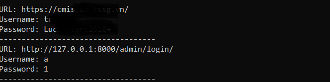

# A simple Stealer bypass Microsoft Window Defender to get Google chrome credentials

A simple stealer written in C++ to capture saved credentials in google chrome, not detected by Window Defender (tested on 8/23/2024 : Windows 10 22H2 latest)

## I. Installation

- ***Mingw***:
    *note that I try to use Microsoft Visual Studio to build exe but I got a lot of errors with lib and header file, you can use MVS if you want, or install Mingw like me*

```bash
sudo apt-get update
sudo apt-get install mingw-w64 -y
```
## II. Usage
### 1. Build virus
***Note:*** *As this build contains quite a lot static libs, install necessary header and libs in /usr/x86_64-w64-mingw32/ before and then build it*
```bash
x86_64-w64-mingw32-g++ -o a.exe chromestealer.cpp /usr/x86_64-w64-mingw32/lib/libssl.a /usr/x86_64-w64-mingw32/lib/libcrypto.a -static-libgcc -static-libstdc++ -lsqlite3 -lcrypt32 -lshlwapi -lws2_32
```

***Note:*** *Default mingw installation doesn't contain ssl, crypto, sqlite3 static libs, you can download it from source, then build header file (.h file) and copy it to /usr/x86_64-w64-mingw32/include, build lib (.a file) and copy to /usr/x86_64-w64-mingw32/lib*



> [!CAUTION]
> There is no clean code, no penetration test provided, this repo is for educational purposes only. Do not use for illegal purposes. I'm never responsible for illegal use. Educational purpose only!
## Support me (optional)
If you find it useful, you can support me with a cup of coffee.
[](https://ko-fi.com/Y8Y2123O0D)